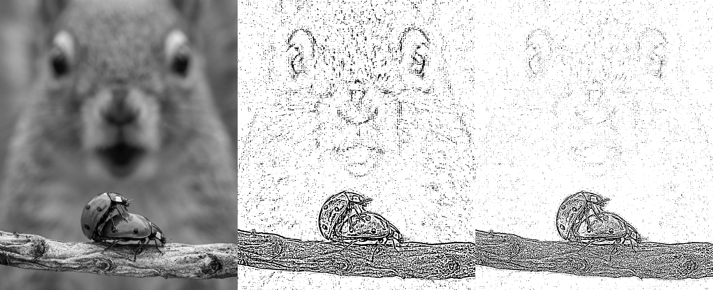
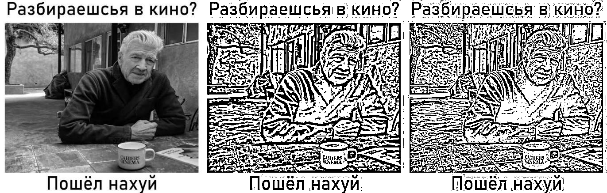
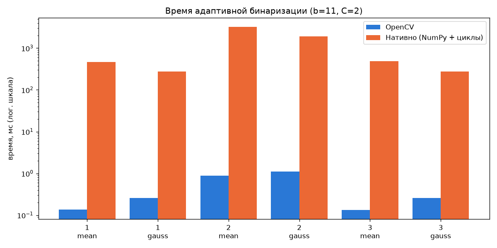
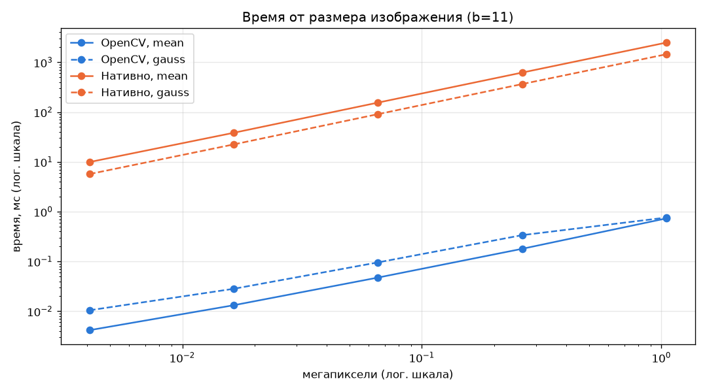
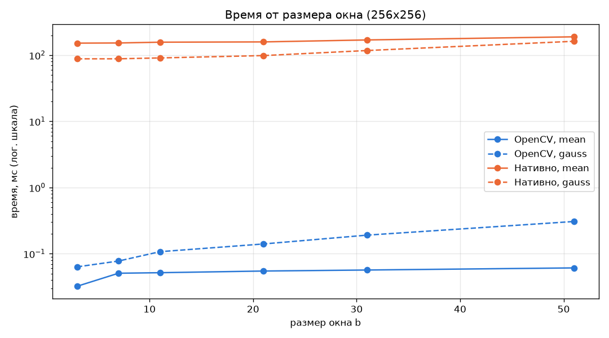

# Лабораторная работа №1. Бинаризация с адаптивным порогом

**Цель:** научиться реализовывать один из простых алгоритмов обработки изображений.

**Вариант:** бинаризация с адаптивным порогом (реализованы оба способа — mean и gaussian).

## 1. Теоретическая база

**Бинаризация** превращает полутоновое изображение в чёрно-белое: пиксель становится белым (255), если его яркость больше порога $T$, иначе — чёрным (0) [1, раздел «Simple Thresholding»].

При **глобальной** бинаризации порог один на всё изображение. Если освещение неравномерное (тени, блики), единого подходящего порога нет: в тёмной части кадра фон может быть темнее, чем объект в светлой [1, раздел «Adaptive Thresholding»; 4, гл. 10.3].

При **адаптивной** бинаризации порог считается для каждого пикселя по его окрестности — окну $b \times b$ [2, описание функции `adaptiveThreshold`, формула для `THRESH_BINARY`]:

$$T(x, y) = M(x, y) - C, \qquad B(x, y) = \begin{cases} 255, & I(x, y) > T(x, y) \\ 0, & \text{иначе} \end{cases}$$

* **mean** — $M$ равно среднему арифметическому яркостей в окне [2, `AdaptiveThresholdTypes` → `ADAPTIVE_THRESH_MEAN_C`];
* **gaussian** — $M$ равно взвешенной сумме с гауссовым ядром: центральные пиксели окна весят больше [2, `AdaptiveThresholdTypes` → `ADAPTIVE_THRESH_GAUSSIAN_C`]. Коэффициенты ядра $G_i = \alpha\, e^{-(i - (b-1)/2)^2 / (2\sigma^2)}$, $i = 0..b-1$, где $\alpha$ нормирует сумму к 1, а $\sigma = 0.3\,((b-1)/2 - 1) + 0.8$ [3, описание функции `getGaussianKernel`, параметр `sigma`].

Параметры:
* $b$ — размер окна, нечётный: 3, 5, 7, … [2, параметр `blockSize`]. Окно должно быть больше толщины объектов (наблюдение по результатам экспериментов);
* $C$ — константа, вычитаемая из среднего, обычно положительная [2, параметр `C`]. При $C > 0$ однородный фон уходит в белый, а не в шум (следует из формулы: на однородном фоне $I \approx M > M - C$).

## 2. Описание системы

| Файл | Что делает |
|---|---|
| [opencv_code.py](opencv_code.py) | `adaptive_threshold_cv` — встроенная `cv2.adaptiveThreshold` |
| [numpy_code.py](numpy_code.py) | `adaptive_threshold_native` — нативная реализация |
| [benchmark.py](benchmark.py) | запускает обе версии на `*.jpg`, сравнивает время и результат; замеряет время в зависимости от размера изображения и окна; сохраняет картинки и графики в `results/` |

Алгоритм нативной версии:
1. Дополнить изображение по краям на $b/2$ пикселей повтором крайних значений (`np.pad(..., mode='edge')`). Так обрабатывает края OpenCV: «The BORDER_REPLICATE | BORDER_ISOLATED is used to process boundaries» [2, параметр `adaptiveMethod`].
2. Для `gauss` построить ядро $b \times b$: внешнее произведение одномерного гауссова ядра на само себя, нормированное к сумме 1 [3, описание `getGaussianKernel`: «Two of such generated kernels can be passed to sepFilter2D»].
3. Двойным циклом пройти по всем пикселям, вырезать окно $b \times b$ и посчитать $M$: `np.mean(window)` или `np.sum(window * kernel)`.
4. Округлить $M$ до целого, вычесть $C$ и сравнить: `np.where(image > M - C, 255, 0)`. Строгое `>` взято из формулы `THRESH_BINARY` [2]. Округление в документации не описано: OpenCV хранит промежуточное среднее в `uint8` [6, функция `adaptiveThreshold`].

Запуск:

```bash
uv sync
uv run python Lab1/benchmark.py
```

## 3. Результаты

Параметры: $b = 11$, $C = 2$. Машина: Apple M4, Python 3.14, NumPy 2.5, OpenCV 5.0. Время OpenCV — лучшее из 10 запусков, нативной версии — один запуск.

На каждой картинке слева направо: исходное изображение, mean, gaussian.





| Изображение | Метод | OpenCV, мс | Нативно, мс | OpenCV быстрее в | Совпадение |
|---|---|---|---|---|---|
| 1.jpg (399x501) | mean | 0.13 | 450 | x3348 | 100.000% |
| 1.jpg (399x501) | gauss | 0.25 | 274 | x1107 | 100.000% |
| 2.jpg (1044x1280) | mean | 0.86 | 3053 | x3553 | 100.000% |
| 2.jpg (1044x1280) | gauss | 1.03 | 1823 | x1770 | 100.000% |
| 3.jpg (457x437) | mean | 0.13 | 477 | x3574 | 100.000% |
| 3.jpg (457x437) | gauss | 0.26 | 270 | x1030 | 100.000% |



**Время от размера изображения.** 2.jpg приводится к квадрату 64…1024 px, b = 11.



| Размер | OpenCV mean | OpenCV gauss | Нативно mean | Нативно gauss |
|---|---|---|---|---|
| 64x64 | 0.005 | 0.011 | 9.9 | 5.7 |
| 128x128 | 0.015 | 0.029 | 38.6 | 22.3 |
| 256x256 | 0.05 | 0.10 | 154 | 89 |
| 512x512 | 0.19 | 0.33 | 610 | 356 |
| 1024x1024 | 0.73 | 0.76 | 2415 | 1438 |

(время в мс)

**Время от размера окна.** Изображение 256x256, b = 3…51.



| b | OpenCV mean | OpenCV gauss | Нативно mean | Нативно gauss |
|---|---|---|---|---|
| 3 | 0.03 | 0.06 | 147 | 86 |
| 7 | 0.05 | 0.08 | 149 | 84 |
| 11 | 0.05 | 0.10 | 151 | 87 |
| 21 | 0.05 | 0.14 | 154 | 94 |
| 31 | 0.06 | 0.19 | 163 | 116 |
| 51 | 0.06 | 0.31 | 186 | 160 |

(время в мс)

Закономерности:
* Нативная версия выдаёт **тот же результат**, что и OpenCV: совпадают 100 % пикселей.
* OpenCV быстрее в **1000–3600 раз**.
* **Время растёт линейно с числом пикселей.** На лог-лог графике линии прямые: увеличение стороны вдвое (×4 пикселей) даёт ×4 по времени. У OpenCV на маленьких картинках рост чуть медленнее — там заметны накладные расходы на вызов функции.
* **От размера окна OpenCV-mean почти не зависит** (box-фильтр считает сумму окна за O(1) на пиксель), а OpenCV-gauss растёт линейно с b (сепарабельная свёртка, O(b) на пиксель).
* **Нативная версия почти не зависит от b при малых окнах** (+4 % от b = 3 до b = 21 для mean), хотя на окно приходится b² операций. Основное время уходит не на арифметику, а на накладные расходы Python на каждый пиксель: итерацию цикла, создание среза, вызов функции NumPy. Только при b ≥ 31 рост объёма окна становится заметен (+26 % для mean и +87 % для gauss при b = 51).
* В нативной версии `gauss` оказался быстрее `mean`: `np.sum(window * kernel)` дешевле, чем `np.mean(window)`, у которого больше накладных расходов на вызов. В OpenCV наоборот — gauss дороже.
* По картинкам: текст хорошо читается в обоих методах. На фотографиях адаптивный порог работает как выделитель контуров — однородные области становятся белыми, остаются края и текстура. Gaussian даёт меньше шума и более тонкие линии, чем mean.

## 4. Выводы

1. Адаптивная бинаризация реализована двумя способами: через `cv2.adaptiveThreshold` и нативно (цикл по пикселям + NumPy для окна). Результаты совпадают попиксельно.
2. Адаптивный порог справляется с неравномерным освещением и хорошо выделяет текст и контуры. Gaussian-вариант даёт более чистый результат, чем mean.
3. Время обеих реализаций растёт линейно с размером изображения. Встроенная функция OpenCV быстрее нативной в тысячи раз. OpenCV написан на C++ с векторизацией, считает среднее за $O(1)$ на пиксель (box-фильтр) или через сепарабельную свёртку и работает в несколько потоков. Нативная версия выполняет Python-цикл по каждому пикселю и для каждого окна заново обрабатывает $b^2$ значений. Основная часть времени уходит на накладные расходы интерпретатора на каждый пиксель, поэтому размер окна на скорость нативной версии почти не влияет.

## 5. Использованные источники

1. OpenCV: Image Thresholding. — https://docs.opencv.org/4.x/d7/d4d/tutorial_py_thresholding.html
2. OpenCV: `cv::adaptiveThreshold`. — https://docs.opencv.org/4.x/d7/d1b/group__imgproc__misc.html
3. OpenCV: `cv::getGaussianKernel`. — https://docs.opencv.org/4.x/d4/d86/group__imgproc__filter.html
4. Gonzalez R. C., Woods R. E. Digital Image Processing. 4th ed. — Pearson, 2018. — Гл. 10.3 «Thresholding».
5. NumPy documentation. — https://numpy.org/doc/stable/
6. Исходный код OpenCV: modules/imgproc/src/thresh.cpp, функция `adaptiveThreshold`. — https://github.com/opencv/opencv/blob/4.x/modules/imgproc/src/thresh.cpp
